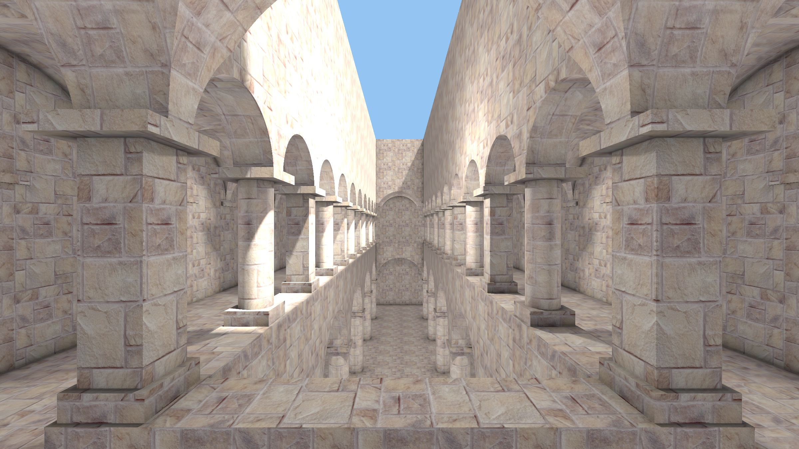
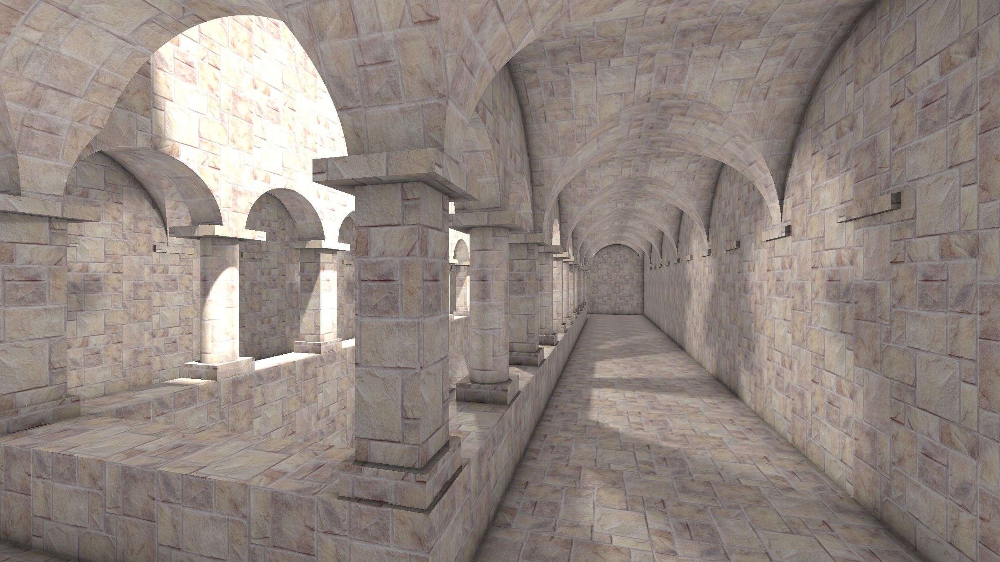
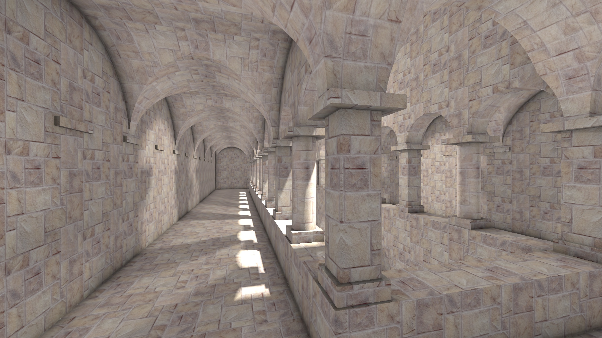

# Final_Project

## 选题

> 2.4.2 用两个三角形渲染世界 (难度等级：2.5)
>
> 你需要多少个三角形来表示此场景并进行渲染？仅仅只需两个！本文将教你 如何使用距离场表示几何图形，以及如何在片段着色器中实时渲染它们！注意，此 项目要求你使用 GPU 的着色器，同样，你可以使用 OpenGL / DirectX / Vulkan， 也可以直接使用 ShaderToy 来完成。

## 项目介绍

本项目的选题为『**2.4.2 用两个三角形渲染世界 (难度等级：2.5)**』。

这里使用 Shadertoy 编写了一个简易的Sponza 场景。其中，我使用了 SDF来表示场景，并用Ray Marching 方法渲染场景图像，并实现了 lambert 光照和一种基于 SDF 的环境光遮蔽（AO）。

代码链接：https://www.shadertoy.com/view/flSSRz

打开链接即可阅读代码，并编译运行。

（上述链接中，在代码开头声明了邮箱地址，与本人在 smartchair 注册账号使用的邮箱一致，以证明是该代码为本人所写。）

本项目文件中存档了一份代码，在文件夹`code`中，与上述链接中的代码一致，以备离线查看，但不能编译运行。

## 运行截图和视频

### 截图

### 视频

视频演示在`videos`文件夹中。

## 实现

* 第6行-第35行：数学常数，随机数，光源数值等。
* 第35行-第223行：基本SDF 函数（圆柱体，方形，长方体）和场景 SDF 函数（由基本 SDF 函数通过布尔运算构成）
* 第224行-第247行：Ray Marching 函数。
* 第248行-第282行：光源可见性检测函数，可检测由一点发射的光线是否可达光源而不被遮挡。
* 第283行-第350行：着色相关函数，包括法线生成函数，AO 计算函数，lambert 光照函数和着色函数。
* 第351行-第371行：相机模型函数，用于生成从相机出发的光线。
* 第372行-第406行： mainImage 函数，整个程序的入口。
